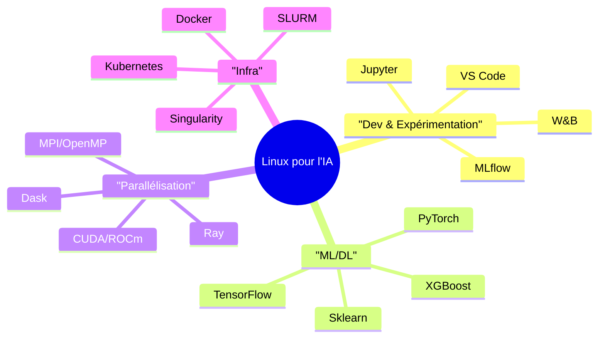
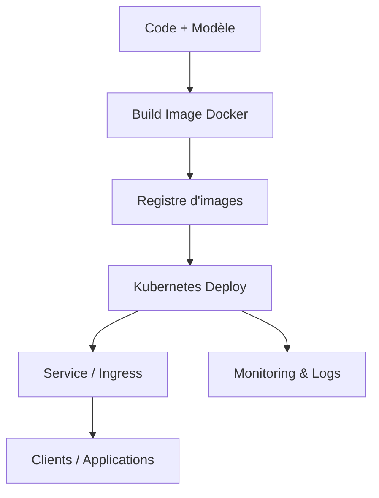

# Introduction à Linux pour l'Intelligence Artificielle

**Maîtriser Linux pour développer et déployer des solutions d’IA performantes.**

## Ressources complémentaires

Les exercices, scripts d’installation et configurations détaillées se trouvent dans le repository GitHub accompagnant ce cours.

## Table des matières

1. [Pourquoi Linux pour l’IA ?](#pourquoi-linux-pour-lia-)
2. [Écosystème IA sur Linux](#écosystème-ia-sur-linux)
3. [Distributions spécialisées IA](#distributions-spécialisées-ia)
4. [Environnements Python pour l’IA](#environnements-python-pour-lia)
5. [Accélération GPU et calcul parallèle](#accélération-gpu-et-calcul-parallèle)
6. [Containers et virtualisation IA](#containers-et-virtualisation-ia)
7. [Frameworks et bibliothèques essentiels](#frameworks-et-bibliothèques-essentiels)
8. [Gestion des données et stockage](#gestion-des-données-et-stockage)
9. [Déploiement et production](#déploiement-et-production)
10. [Monitoring et optimisation](#monitoring-et-optimisation)
11. [Annexes — Exemples pratiques](#annexes--exemples-pratiques)

---

## Pourquoi Linux pour l’IA ?

### Linux, socle de l’IA moderne

Linux est la plateforme de référence pour le développement, l’entraînement et le déploiement de modèles d’IA grâce à sa performance, sa stabilité et la richesse de son écosystème.

**Atouts concrets**

* Performance : gestion fine CPU/GPU, optimisations bas niveau, planification efficace.
* Ouverture : outils et frameworks open source, forte communauté, reproductibilité.
* Scalabilité : du poste individuel au cluster HPC ou cloud managé.
* Coûts : réduction des licences et meilleure maîtrise de l’infrastructure.

**Adoption (ordre de grandeur)**

| Domaine                  | Adoption Linux | Raison principale             |
| ------------------------ | -------------: | ----------------------------- |
| Centres de calcul IA     |           95%+ | Performance, scalabilité      |
| Recherche académique     |           90%+ | Outils ouverts, collaboration |
| Cloud IA (AWS/GCP/Azure) |           85%+ | Containers, orchestration     |
| Dev ML/DL                |           80%+ | Écosystème Python             |
| Edge Computing           |           70%+ | Efficacité, personnalisation  |

**Cycle de vie d’un projet IA (vue simplifiée)**


---

## Écosystème IA sur Linux

* **Applications** : Jupyter, MLflow, Weights & Biases, Streamlit, Gradio.
* **Frameworks** : PyTorch, TensorFlow, scikit-learn, XGBoost, LightGBM.
* **Parallélisation** : CUDA/ROCm (GPU), Dask/Ray (Python), OpenMP/MPI (CPU/HPC).
* **Infrastructure** : Docker/Compose, Kubernetes, SLURM, Singularity, Ansible.

**Cartographie rapide**



---

## Distributions spécialisées IA

**Recommandé pour démarrer** : **Ubuntu 22.04 LTS** (poste, WSL2, VM, serveur).

* Avantages : documentation abondante, drivers GPU bien supportés, images Docker officielles, écosystème Python/IA mature.

**Autres options**

| Distribution      | Cas d’usage        | Points forts                            |
| ----------------- | ------------------ | --------------------------------------- |
| Rocky/AlmaLinux 9 | Serveurs/HPC       | Stabilité, sécurité, compatibilité RHEL |
| Pop!\_OS          | Station de travail | Support GPU soigné, ergonomie dev       |
| Lambda Stack      | DL prêt à l’emploi | PyTorch/TensorFlow + CUDA intégrés      |
| Debian            | Stabilité          | Base solide, dépôts vastes              |

---

## Environnements Python pour l’IA

**Objectif** : éviter les conflits de versions et garantir la reproductibilité.

| Besoin                | Outil         | Idée directrice                                |
| --------------------- | ------------- | ---------------------------------------------- |
| Exploration/Notebooks | Conda/Mamba   | Un environnement par projet, facile à partager |
| Produit/Librairies    | Poetry        | Dépendances verrouillées, packaging propre     |
| Prod/Cloud            | Docker + venv | Isolation totale, images immuables             |

---

## Accélération GPU et calcul parallèle

**NVIDIA / CUDA**

* Pilotes NVIDIA, **pytorch-cuda**, **cuDNN**, **TensorRT**, écosystème mature.

**AMD / ROCm**

* Plateforme ouverte, **PyTorch ROCm**, **MIOpen**, compatibilité selon GPU.

**Bon à connaître**

* Backends de communication : **NCCL** (NVIDIA), **Gloo**, **MPI**.
* Variables utiles : `CUDA_VISIBLE_DEVICES`, `NCCL_DEBUG`, `OMP_NUM_THREADS`.

---

## Containers et virtualisation IA

**Pourquoi** : reproductibilité, portabilité, uniformité dev→prod.

* **Docker** : images PyTorch/TensorFlow officielles, `docker compose` pour orchestrer Jupyter, API, base de données, monitoring.
* **Kubernetes** : jobs (entraînement), deployments (serving), GPU operators (allocation).
* **Singularity/Apptainer** : standard HPC (sécurité sans root, intégration SLURM).

---

## Frameworks et bibliothèques essentiels

* **ML classique** : scikit-learn, XGBoost, LightGBM.
* **Deep Learning** : PyTorch (souvent prioritaire), TensorFlow/Keras.
* **Visualisation** : Matplotlib, Seaborn, Plotly.
* **Suivi d’expériences** : MLflow, Weights & Biases.

---

## Gestion des données et stockage

**Bonnes pratiques**

* Séparer **données brutes**, **données traitées**, **artefacts** (modèles, métriques).
* Versionner les gros fichiers : **DVC** ou **Git LFS**.
* Centraliser la configuration : fichiers `.env`, stockage d’artefacts (S3, GCS, MinIO).
* Traçabilité : feuilles de route données → modèles (MLflow/DVC).

---

## Déploiement et production

* **Serving** : FastAPI, TorchServe, TF Serving, Triton Inference Server.
* **CI/CD** : GitHub Actions/GitLab CI pour builder, tester, publier des images.
* **Orchestration** : Kubernetes (autoscaling, rolling updates), ingress, observabilité.

**Chaîne type**



---

## Monitoring et optimisation

* **Système** : `htop`, `iostat`, `vmstat`.
* **GPU** : `nvidia-smi`, `rocm-smi`, `nvtop`, `gpustat`.
* **Appli** : Prometheus/Grafana, OpenTelemetry, logs structurés.
* **Performance** : profils PyTorch/TensorFlow, quantification/pruning, ONNX, TensorRT.

---

## Annexes — Exemples pratiques

> Les blocs suivants sont fournis dans le repository (scripts reproductibles).
> Ils ne sont pas nécessaires pour comprendre les sections précédentes, mais prêts à l’emploi pour expérimenter.

### A. Environnement Python minimal (CPU) avec Mamba

```bash
# scripts/env_cpu.sh
# Crée un environnement reproductible pour notebooks et ML classique.
mamba create -n ia python=3.11 -y
conda activate ia
mamba install -y numpy pandas scikit-learn jupyterlab matplotlib
```

### B. PyTorch avec CUDA (NVIDIA)

```bash
# scripts/pytorch_cuda.sh
# Installe PyTorch avec support CUDA (version adaptée aux canaux PyTorch/NVIDIA).
conda activate ia
mamba install -y pytorch torchvision torchaudio pytorch-cuda=12.1 -c pytorch -c nvidia
python -c "import torch; print('CUDA dispo:', torch.cuda.is_available())"
```

### C. Démarrer MLflow en local

```bash
# scripts/mlflow_local.sh
pip install mlflow
mlflow ui --port 5000
# Ouvrir http://localhost:5000
```

### D. Dockerfile minimal pour servir une API

```dockerfile
# docker/Dockerfile
FROM python:3.11-slim
WORKDIR /app
COPY app.py /app
RUN pip install --no-cache-dir fastapi uvicorn
CMD ["uvicorn", "app:app", "--host", "0.0.0.0", "--port", "8000"]
```

---

## Conclusion

Linux concentre l’écosystème, la performance et les outils nécessaires pour mener un projet d’IA de bout en bout. La progression recommandée est simple : **choisir une distribution stable**, **isoler l’environnement Python**, **expérimenter avec notebooks**, **emballer en containers**, puis **déployer** avec un **monitoring** solide.
