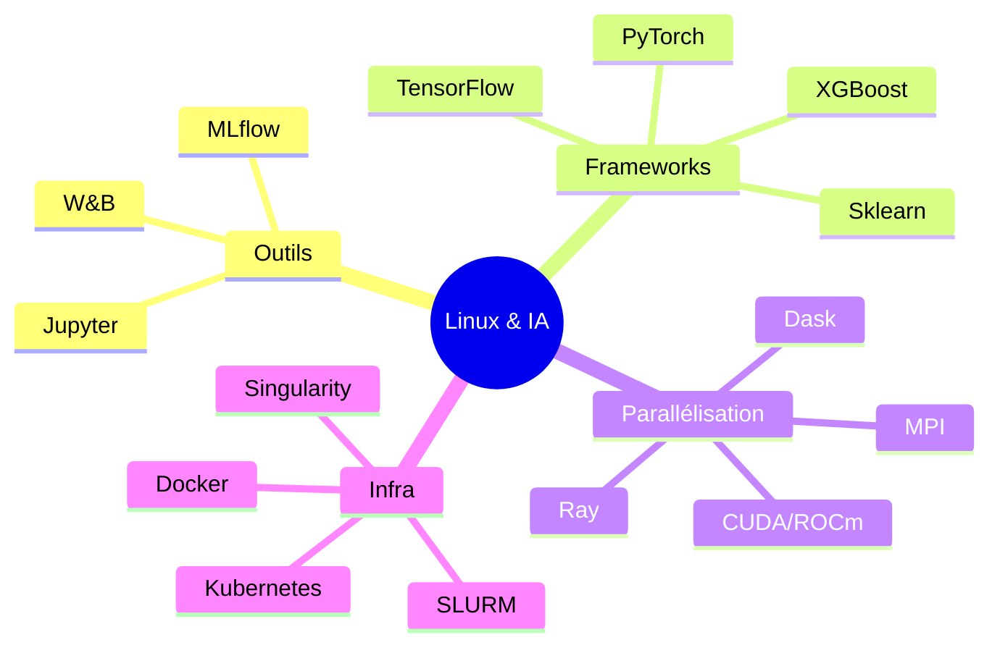
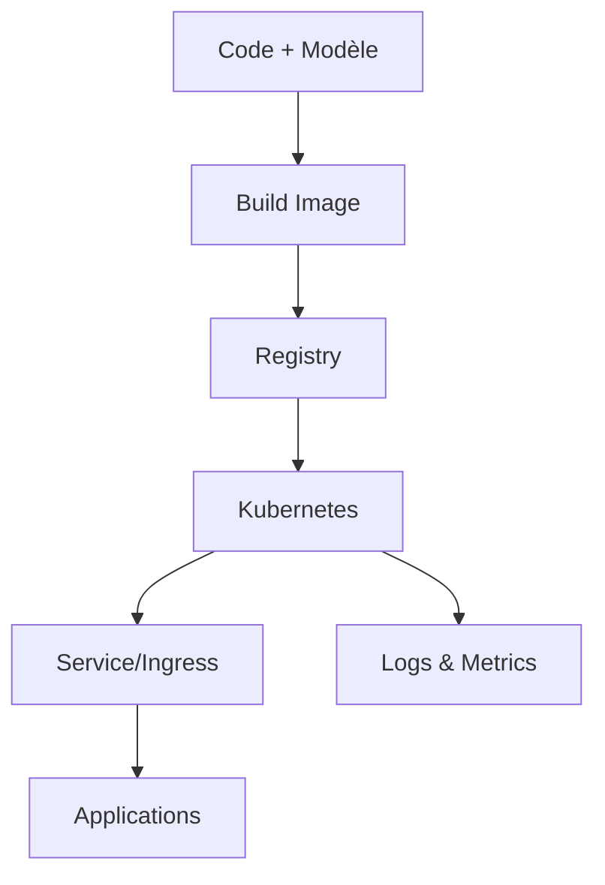

# Introduction à Linux pour l'Intelligence Artificielle

Maîtriser Linux pour **développer**, **entraîner** et **déployer** des solutions d’IA performantes.

## Ressources complémentaires

Les exercices, scripts d’installation et configurations détaillées sont fournis dans le repository accompagnant ce cours.

## Table des matières

1. [Pourquoi Linux pour l’IA ?](#pourquoi-linux-ia)
2. [Écosystème IA sur Linux](#ecosysteme-ia)
3. [Distributions spécialisées IA](#distributions-ia)
4. [Environnements Python pour l’IA](#environnements-python)
5. [Accélération GPU et calcul parallèle](#acceleration-gpu)
6. [Containers et virtualisation IA](#containers-ia)
7. [Frameworks et bibliothèques essentiels](#frameworks-bibliotheques)
8. [Gestion des données et stockage](#gestion-donnees)
9. [Déploiement et production](#deploiement-production)
10. [Monitoring et optimisation](#monitoring-optimisation)
11. [Annexe — Exemples pratiques](#annexe-exemples-pratiques)

## Pourquoi Linux pour l’IA ? {#pourquoi-linux-ia}

**Idée clé.** Linux est la plateforme de référence pour la R\&D et la production en IA grâce à sa performance, son ouverture et sa portabilité (poste local, cloud, HPC, edge).

**Points saillants**

* **Performance** : ordonnancement efficace, gestion fine CPU/GPU, optimisations bas niveau.
* **Ouverture** : écosystème open source, reproductibilité, transparence.
* **Scalabilité** : même pile technique du notebook au cluster Kubernetes.
* **Coût** : réduction des licences et standardisation des environnements.

**Cycle de vie typique d’un projet IA**

## Écosystème IA sur Linux {#ecosysteme-ia}

* **Applications** : Jupyter, MLflow, Weights & Biases, Streamlit, Gradio.
* **Frameworks** : PyTorch, TensorFlow, scikit-learn, XGBoost.
* **Parallélisation** : CUDA/ROCm (GPU), Dask/Ray (Python), OpenMP/MPI (CPU/HPC).
* **Infrastructure** : Docker/Compose, Kubernetes, SLURM, Singularity, Ansible.

**Carte mentale**

## Distributions spécialisées IA {#distributions-ia}

**Recommandation de départ :** **Ubuntu 22.04 LTS** (poste/serveur/WSL2) pour sa documentation, ses drivers GPU et ses images officielles.

**Autres options**

| Distribution      | Cas d’usage        | Points forts                  |
| ----------------- | ------------------ | ----------------------------- |
| Rocky/AlmaLinux 9 | Serveurs/HPC       | Stabilité, compatibilité RHEL |
| Pop!\_OS          | Station de travail | Support GPU soigné            |
| Lambda Stack      | DL prêt à l’emploi | PyTorch/TensorFlow + CUDA     |
| Debian            | Stabilité          | Base robuste, dépôts vastes   |

## Environnements Python pour l’IA {#environnements-python}

**Objectif :** éviter les conflits de versions et garantir la reproductibilité.

| Contexte              | Outil         | Idée directrice              |
| --------------------- | ------------- | ---------------------------- |
| Exploration/Notebooks | Conda/Mamba   | Un environnement par projet  |
| Produit/Librairie     | Poetry        | Dépendances verrouillées     |
| Prod/Cloud            | Docker + venv | Images immuables & portables |

## Accélération GPU et calcul parallèle {#acceleration-gpu}

* **NVIDIA / CUDA** : écosystème mature (cuDNN, TensorRT, pytorch-cuda).
* **AMD / ROCm** : alternative ouverte (MIOpen), support selon matériel.
* **Distribution** : multi-GPU/multi-nœuds via **NCCL**, **Gloo**, **MPI** ; réseaux rapides (**InfiniBand/RDMA**).

## Containers et virtualisation IA {#containers-ia}

* **Docker/Compose** : reproductibilité, orchestration multi-services (Jupyter, API, DB, monitoring).
* **Kubernetes** : jobs d’entraînement, déploiements d’inférence, GPU operators.
* **Singularity/Apptainer** : standard HPC (sécurité sans root, intégration SLURM).

## Frameworks et bibliothèques essentiels {#frameworks-bibliotheques}

* **ML** : scikit-learn, XGBoost, LightGBM.
* **DL** : PyTorch (souvent prioritaire), TensorFlow/Keras.
* **Visu** : Matplotlib, Seaborn, Plotly.
* **Suivi** : MLflow, Weights & Biases.

## Gestion des données et stockage {#gestion-donnees}

Bonnes pratiques : séparer **brut/traité/artefacts**, versionner (DVC/Git LFS), gérer les secrets (.env), formats efficaces (Parquet). Stockage d’artefacts (S3/GCS/MinIO) recommandé.

## Déploiement et production {#deploiement-production}

* **Serving** : FastAPI, TorchServe, TF Serving, Triton.
* **CI/CD** : GitHub Actions/GitLab CI pour builder, tester, publier des images.
* **Observabilité** : Prometheus/Grafana, logs structurés, traçage distribué.

**Chaîne type**

## Monitoring et optimisation {#monitoring-optimisation}

* **Système** : `htop`, `iostat`, `vmstat`.
* **GPU** : `nvidia-smi`, `rocm-smi`, `nvtop`, `gpustat`.
* **Modèles** : profils PyTorch/TF, quantification/pruning, ONNX, TensorRT.

## Annexe — Exemples pratiques {#annexe-exemples-pratiques}

> Les scripts correspondants (installation, environnements, Dockerfiles, démo FastAPI, démarrage MLflow) sont fournis dans le dossier `scripts/` et `docker/` du repository.
> Ils sont optionnels pour la lecture mais prêts à exécuter pour expérimenter.

* `scripts/env_cpu.sh` — environnement Python minimal (CPU).
* `scripts/pytorch_cuda.sh` — installation PyTorch + CUDA (vérification `torch.cuda.is_available()`).
* `scripts/mlflow_local.sh` — lancement de l’UI MLflow en local.
* `docker/Dockerfile` — image minimale pour servir une API d’inférence.

