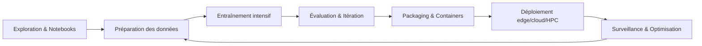
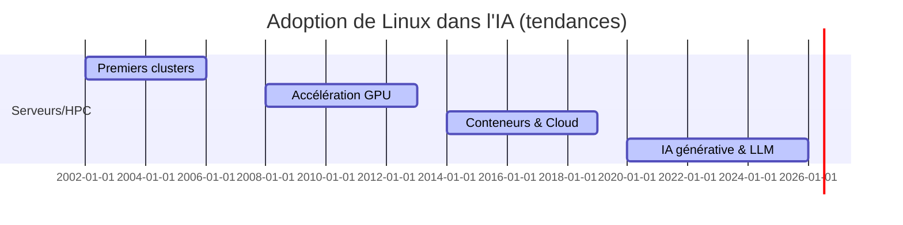
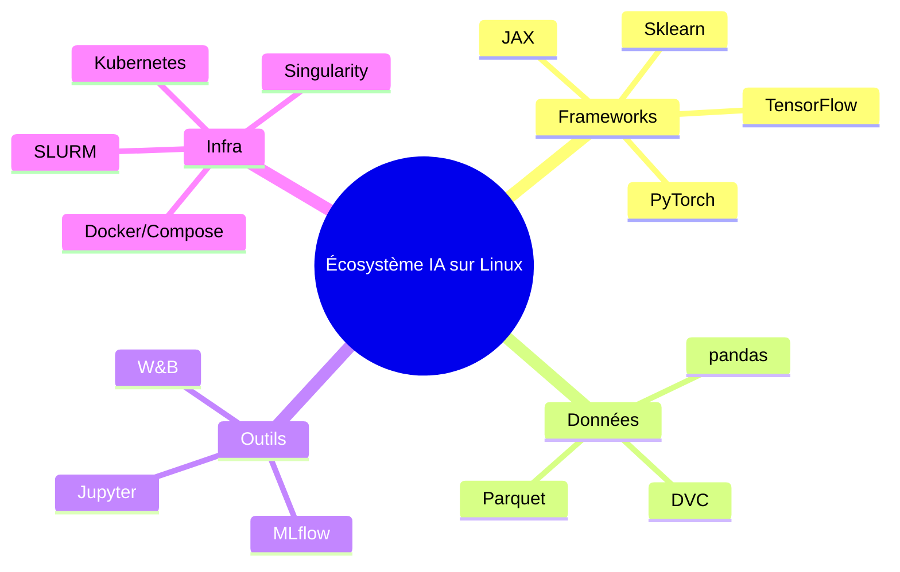
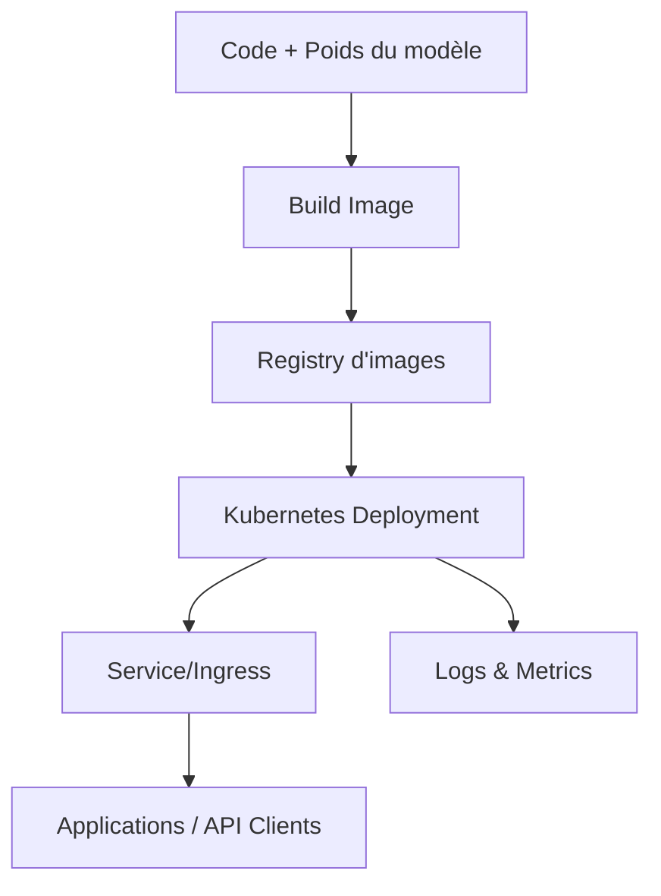

# Pourquoi Linux est devenu l'écosystème de référence pour l’IA mondiale

Linux s’est imposé comme la plateforme standard pour concevoir, entraîner et déployer des systèmes d’IA à toutes les échelles.

## Table des matières

1. [La domination de Linux dans l’IA](#domination-linux-ia)
2. [Avantages techniques fondamentaux](#avantages-techniques)
3. [Écosystème natif et optimisé](#ecosysteme-natif)
4. [Performance et calcul haute performance](#performance-calcul)
5. [Flexibilité et personnalisation](#flexibilite-personnalisation)
6. [Communauté et recherche](#communaute-recherche)
7. [Coût et accessibilité](#cout-accessibilite)
8. [Comparaison avec autres OS](#comparaison-os)
9. [Cas d’étude concrets](#cas-etude-concrets)
10. [Futur et tendances](#futur-tendances)

## La domination de Linux dans l’IA {#domination-linux-ia}

**Ordres de grandeur**

* Supercalculateurs (TOP500) : quasi-totalement Linux.
* Cloud et clusters GPU : large majorité sous Linux.
* Recherche académique et industrielle : frameworks développés, testés et optimisés d’abord sur Linux.

**Cycle de valeur IA (où Linux est dominant)**

**Évolution historique (vue simplifiée)**

## Avantages techniques fondamentaux {#avantages-techniques}

* **Gestion des ressources** : scheduling efficace, affinité CPU/GPU, NUMA-aware.
* **I/O optimisées** : filesystems et planificateurs I/O adaptés aux gros volumes.
* **Accès bas niveau** : réglages kernel et pilotes pour profils IA exigeants.
* **Interop matériel** : GPU NVIDIA (CUDA/cuDNN/TensorRT), AMD (ROCm/MIOpen), accélérateurs (VPU/TPU) via toolchains dédiées.

## Écosystème natif et optimisé {#ecosysteme-natif}

* **Frameworks Deep Learning** : PyTorch, TensorFlow, JAX — prioritairement maintenus et optimisés sur Linux.
* **Stack scientifique** : NumPy, SciPy, pandas, scikit-learn, OpenCV — builds performants (BLAS/LAPACK, MKL/OpenBLAS).
* **Gestion d’environnements** : Conda/Mamba, Poetry, containers — reproductibilité et isolation par projet.

**Cartographie rapide**

## Performance et calcul haute performance {#performance-calcul}

* **GPU-first** : pipelines d’entraînement multi-GPU/multi-nœuds (NCCL, Gloo, MPI).
* **HPC-ready** : InfiniBand/RDMA, ordonnanceurs (SLURM), monitoring fin (CPU/GPU/mémoire).
* **Optimisations modèle** : graph compilers, quantification/pruning, ONNX, TensorRT.

## Flexibilité et personnalisation {#flexibilite-personnalisation}

* **Recherche/Proto** : environnements Conda, notebooks, traçabilité expériences (MLflow/W\&B).
* **Production/Cloud** : images immuables, CI/CD, autoscaling sur Kubernetes.
* **Edge/Embedded** : kernels minimalistes, toolchains ARM/RISC-V, profils temps réel.

## Communauté et recherche {#communaute-recherche}

* **Ouverture** : code source accessible, auditabilité, reproductibilité.
* **Rythme d’innovation** : contributions continues des universités, laboratoires et entreprises.
* **Écosystème d’apprentissage** : documentation abondante, tutoriels, forums, conférences.

## Coût et accessibilité {#cout-accessibilite}

* **Réduction des coûts logiciels** : OS libre, images publiques, outils open source.
* **Économie d’échelle** : standardisation des environnements du laptop au cluster.
* **Portabilité** : moins de verrouillage éditeur, migrations plus simples.

## Comparaison avec autres OS {#comparaison-os}

| Critère                       | Linux                       | Windows                        | macOS                    |
| ----------------------------- | --------------------------- | ------------------------------ | ------------------------ |
| GPU training intensif         | Excellent (CUDA/ROCm natif) | Possible, souvent moins fluide | Limité au hardware Apple |
| Orchestration (K8s/SLURM)     | Natif et mature             | Possible, moins naturel        | Utilisation surtout dev  |
| Reproductibilité (containers) | Standard de facto           | Bon support                    | Bon support              |
| Accès bas niveau / tuning     | Très fin (kernel/driver)    | Plus restreint                 | Plus restreint           |
| Coût/licences                 | Avantageux                  | Licences serveur possibles     | Matériel propriétaire    |

## Cas d’étude concrets {#cas-etude-concrets}

* **Recherche académique** : clusters Linux + SLURM pour entraîner des modèles vision/langage à grande échelle.
* **SaaS IA** : microservices d’inférence conteneurisés, autoscaling Kubernetes, observabilité Prometheus/Grafana.
* **Edge industriel** : images Linux minimalistes avec accélérateurs (VPU/NPU) pour inspection visuelle en temps quasi réel.

**Chaîne type de déploiement**

## Futur et tendances {#futur-tendances}

* **IA générative & LLM** : optimisations GPU/TPU, compilation graphe, serveur d’inférence spécialisé.
* **HPC + Cloud** : convergence workloads batch/streaming avec scheduling unifié.
* **Edge & temps réel** : kernels RT, consommation énergétique optimisée, modèles compacts.
* **Standardisation MLOps** : formats modèles (ONNX), traçabilité complète, sécurité supply-chain.

## Synthèse

Linux concentre la performance, l’ouverture et la portabilité nécessaires pour mener un projet d’IA de l’idée au déploiement. Sa dominance tient autant à la **technique** (GPU, HPC, orchestration) qu’à l’**écosystème** (frameworks natifs, communauté, outils de reproductibilité) et aux **enjeux économiques** (coûts, indépendance, standardisation).
