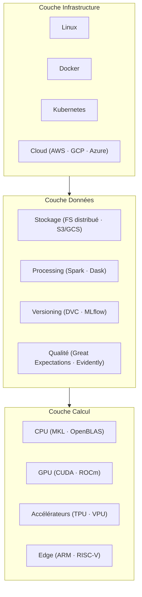
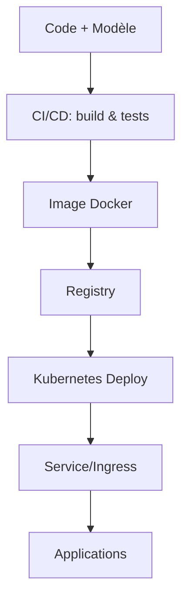
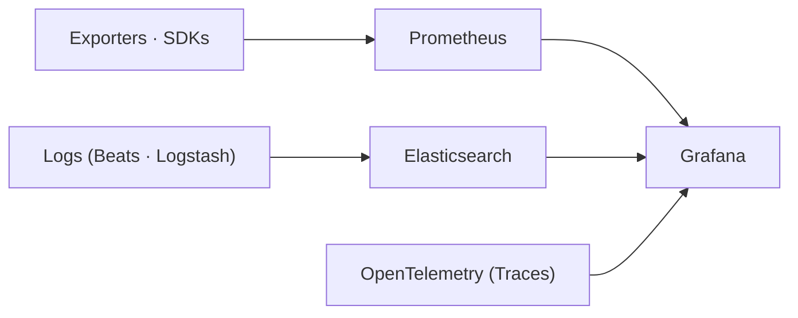

# Écosystème d'outils IA cohérents

Comprendre les outils et leur intégration dans l’écosystème IA.

## Table des matières

1. [Vue d’ensemble de l’écosystème](#vue-ensemble)
2. [Frameworks et bibliothèques](#frameworks-bibliotheques)
3. [Outils de développement](#outils-developpement)
4. [Infrastructure et déploiement](#infrastructure-deploiement)
5. [Monitoring et observabilité](#monitoring-observabilite)
6. [Annexe — Exemples de stacks](#annexe-exemples-de-stacks)

## Vue d’ensemble de l’écosystème {#vue-ensemble}

**Idée directrice.** Un ensemble modulaire où chaque couche remplit un rôle précis et s’imbrique avec les autres pour créer des pipelines ML/DL efficaces et maintenables.

**Couches principales**

## Frameworks et bibliothèques {#frameworks-bibliotheques}

**Deep Learning (choisir selon le contexte)**

* **TensorFlow** : écosystème complet (Serving, TensorBoard, TFLite).
  *Pertinent* : production à grande échelle, multi-plateforme, GCP.
* **PyTorch** : ergonomie pythonique, recherche et prototypage rapides.
  *Pertinent* : expérimentation, archis custom, forte adoption académique/industrielle.
* **JAX** : XLA compilation, vectorisation/parallélisation avancées.
  *Pertinent* : recherche de pointe, calcul scientifique haute performance.

**Stack scientifique**

* **NumPy / SciPy / pandas / scikit-learn** : base ML traditionnelle et traitement de données.
* **Visualisation** : Matplotlib, Seaborn, Plotly.

**Spécialisées**

* **Vision** : OpenCV, Pillow, Albumentations, ImageIO.
* **NLP** : spaCy, NLTK, Transformers, Gensim.

## Outils de développement {#outils-developpement}

**Environnements interactifs**

* **Jupyter** (Notebook, Lab, Hub) : exploration, documentation exécutable, extensions et widgets.

**IDEs**

* **VS Code** : écosystème d’extensions (Python, Jupyter, Docker, Remote).
* **PyCharm** : IDE Python complet (debug, profiling, DB).

**Gestion des environnements**

* **Conda/Mamba** : dépendances complexes (C/C++, CUDA), environnements isolés, canaux conda-forge/nvidia.
* **Poetry / PDM** : gestion moderne des dépendances et packaging (lock files, venv auto).

**Versioning & collaboration**

* **Git** (GitHub/GitLab) + **Git LFS** pour gros artefacts.
* **DVC** : versioning de données/modèles, pipelines data.
* **MLflow** : suivi d’expériences, registry de modèles, packaging.

## Infrastructure et déploiement {#infrastructure-deploiement}

**Containerisation**

* **Docker** : isolation, reproductibilité, portabilité (images `pytorch/pytorch`, `tensorflow/tensorflow`, `jupyter/datascience-notebook`, `nvidia/cuda`).
* **Docker Compose** : orchestration locale multi-services (Jupyter, API, DB, monitoring).

**Orchestration**

* **Kubernetes** : auto-scaling, rolling updates, GPU operators, CRD ML.
* **SLURM / Singularity** : HPC, sécurité sans root, intégration ordonnanceurs.

**Serving & web**

* **FastAPI** : APIs REST performantes, doc auto, async.
* **Django** : applications web complètes (auth, ORM, admin).
* **Streamlit / Gradio** : interfaces rapides pour démos et validation.

**Chaîne type de déploiement**

## Monitoring et observabilité {#monitoring-observabilite}

**Infra**

* **Prometheus** : collecte métriques (GPU/CPU, latence, throughput).
* **Grafana** : tableaux de bord, alerting multi-sources.

**Qualité des données et modèles**

* **Evidently / WhyLabs / Arize / Fiddler** : dérive, performance, traçabilité.

**Logs & tracing**

* **Elastic Stack (ELK)** : Elasticsearch, Logstash, Kibana, Beats.
* **OpenTelemetry** : traces distribuées, corrélation métriques/logs.

**Topologie d’observabilité**

## Annexe — Exemples de stacks {#annexe-exemples-de-stacks}

**Exploration & proto**

* Ubuntu 22.04 • Conda/Mamba • JupyterLab • PyTorch/TensorFlow • MLflow

**Produit & CI/CD**

* Poetry • Tests (pytest) • GitHub Actions • Docker • Registry privé

**Production & scaling**

* Kubernetes • Autoscaling GPU • FastAPI/Triton • Prometheus/Grafana • ELK

**Edge & industriel**

* Linux embarqué • ARM/TPU/VPU • Docker/Singularity • Monitoring léger • Mise à jour OTA

