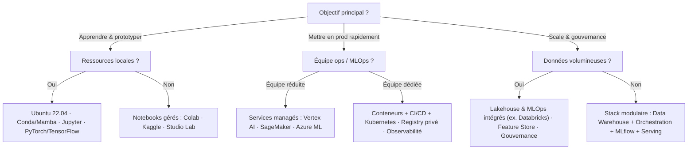

# Ma boîte à outils IA selon mon budget

Choisir les bons outils IA selon les ressources et objectifs.

## Table des matières

1. [Pour apprendre l’IA avec un petit budget](#petit-budget)
2. [Solutions cloud gratuites et économiques](#cloud-gratuit)
3. [Hardware abordable pour l’IA](#hardware-abordable)
4. [Outils pour petites et moyennes entreprises](#pme)
5. [Solutions entreprise et grande échelle](#entreprise)
6. [Aide au choix — Arbre de décision](#arbre-de-decision)
7. [Annexes — Listes courtes par cas](#annexes)

## Pour apprendre l’IA avec un petit budget {#petit-budget}

**Environnement système**

* Ubuntu 22.04 recommandé (natif, VM, ou WSL 2).
* 8 Go RAM minimum (16 Go confortable). GPU NVIDIA utile mais non obligatoire.

**Options d’exécution**

* VM locale (VirtualBox, VMware) : séparer l’environnement sans toucher à l’OS hôte.
* WSL 2 : Linux intégré à Windows, support GPU disponible.
* VPS économiques (DigitalOcean, Vultr, Linode) : point de départ dès env. 5–7 USD / mois.

**Bibliothèques de base**

* Gestion d’environnements : Conda / Mamba ou venv.
* Données et ML classique : NumPy, pandas, scikit-learn.
* Deep learning : PyTorch ou TensorFlow (CPU ou GPU).
* Notebook : JupyterLab / Notebook.
* Accélération : CUDA (NVIDIA) ou ROCm (AMD) si matériel compatible.

**Check-list installation locale (haut niveau)**

* Système à jour → outils de base → gestionnaire d’environnements → bibliothèques scientifiques → notebook opérationnel.

## Solutions cloud gratuites et économiques {#cloud-gratuit}

**Google Colab**

* Jupyter prêt à l’emploi, GPU/TPU gratuits non garantis, sessions limitées.
* Intégration Google Drive, bibliothèques préinstallées.

**Kaggle Notebooks**

* GPU gratuits sur quota hebdomadaire, accès direct aux datasets Kaggle.
* Environnement stable, sélection d’accélérateur à activer.

**AWS SageMaker Studio Lab**

* Gratuit, sans carte de crédit, stockage persistant, sessions CPU/GPU limitées dans le temps.
* Idéal pour expérimenter sans gérer d’infrastructure.

**Comptes cloud d’essai**

* Crédits temporaires (ex. Azure, AWS, Google Cloud) pour tester services IA managés.
* Au-delà du crédit d’essai, facturation à l’usage.

## Hardware abordable pour l’IA {#hardware-abordable}

**Cartes et mini-ordinateurs**

* NVIDIA Jetson (ex. Orin Nano) : Linux natif, GPU intégré, faible conso.

  * Avantages : prototypage embarqué, vision, robotique, IA générative compacte.
  * Limites : mémoire et performance inférieures à un GPU desktop.

**PC existant reconverti**

* GPU conseillé : RTX 3060 ou mieux (≥ 12 Go VRAM).
* RAM : 32 Go pour travailler à l’aise avec des datasets moyens.
* Stockage : SSD NVMe pour I/O rapides.

**Ordres de grandeur**

* Jetson : coût modéré pour projets embarqués.
* Upgrade PC : budget variable selon GPU, SSD et RAM.

## Outils pour petites et moyennes entreprises {#pme}

**Petites entreprises / startups**

* Priorité aux services managés pour limiter l’ops.
* Plates-formes typiques : AWS SageMaker, Google Vertex AI, Azure ML, Paperspace Gradient.
* Avantages : mise à l’échelle à la demande, MLOps intégré, facturation à l’usage.

**Entreprises de taille moyenne**

* Plateformes unifiées Données + ML (ex. Databricks Lakehouse) pour ingestion, features, entraînement, MLOps, gouvernance.
* Alternatives : Snowflake + frameworks ML, Spark managé, etc.
* Remarque : expertise et budget supérieurs nécessaires.

## Solutions entreprise et grande échelle {#entreprise}

**Infrastructures sur site**

* Clusters GPU sur mesure (réseau InfiniBand, stockage parallèle, ordonnanceur SLURM).
* Stations/baies spécialisées pour entraînements lourds et R\&D avancée.

**Plateformes et MLOps**

* Périmètre : data lineage, catalogues, gouvernance, déploiements multi-environnements, traçabilité et conformité.
* Exemples : Databricks (multi-cloud), AWS SageMaker Enterprise, Google Vertex AI Enterprise, Kubeflow + MLflow.

**Sécurité & conformité**

* Isolation réseau, IAM centralisé, secrets manager, audit et standardisation des images de base.
* Observabilité bout en bout (métriques, logs, traces, dérive).

## Aide au choix — Arbre de décision {#arbre-de-decision}

## Annexes — Listes courtes par cas {#annexes}

**Exploration à coût minimal**

* Exécution : Google Colab ou Kaggle Notebooks.
* Données/ML : NumPy, pandas, scikit-learn, PyTorch/TensorFlow.
* Traçabilité : MLflow léger (local) ou suivi intégré à la plateforme.

**Poste local polyvalent**

* OS : Ubuntu 22.04 ou WSL 2.
* Environnements : Conda/Mamba.
* Outils : JupyterLab, VS Code.
* Accélération : CUDA / ROCm si compatible.

**Cloud économique et progressif**

* Notebooks managés → jobs managés → serveurs d’inférence managés.
* Registry de modèles, A/B testing, suivi coûts.

**PME orientée produit**

* Dev : Poetry + tests (pytest) + CI (GitHub Actions).
* Packaging : Docker, Registry privé.
* Déploiement : Kubernetes ou services managés d’inférence.
* Observabilité : Prometheus + Grafana, logs centralisés (ELK), détection de dérive (Evidently).

**Entreprise & scale**

* Données : Lakehouse, gouvernance, catalogues et policy.
* MLOps : pipelines CI/CD, registry de modèles, promotion par environnements.
* Sécurité : IAM, secrets, policies réseau, audit.
* Plateformes : Databricks / Vertex AI / SageMaker ou stack Kubernetes + Kubeflow + MLflow.

- **Synthèse**:

- Commencer avec des notebooks gérés pour limiter les coûts et la complexité, consolider un poste local reproductible (Ubuntu + Conda), puis migrer vers des services ou une stack conteneurisée lorsque les besoins de collaboration, de performance et de fiabilité augmentent. L’essentiel est d’aligner les choix d’outils sur le budget, l’objectif et le niveau d’opérationnalisation attendu.

