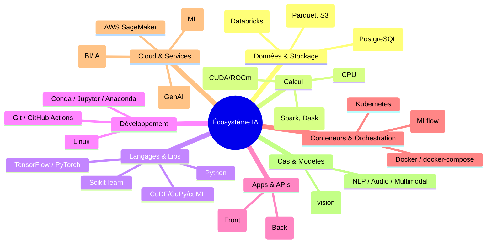
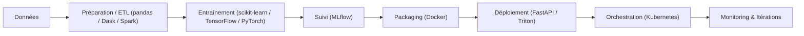
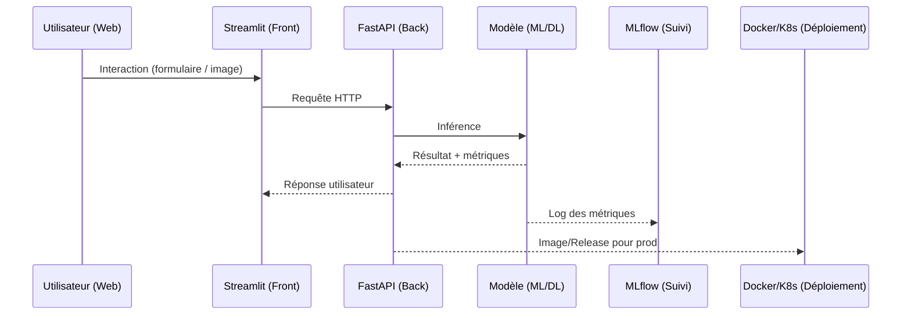

<h1 id="intro-ecosysteme-ia">Introduction à l’écosystème en Intelligence Artificielle</h1>

Objectif : offrir une vue d’ensemble claire et non technique de l’écosystème IA — du stockage et calcul jusqu’au déploiement — avec des repères concrets pour se situer.

<h2 id="carte-densemble">1. Carte d’ensemble de l’écosystème</h2>



<h2 id="stockage-calcul">2. Stockage et Calcul</h2>


## 2.1 Stockage des données

### 2.1.1 Stockage fichiers et objets

* **Fichiers plats (CSV, Parquet)** :

  * **CSV** : format texte simple, lisible, mais peu optimisé pour l’analytique.
  * **Parquet** : format colonne compressé, beaucoup plus efficace pour la lecture sélective et les gros volumes (ex. Big Data, Spark).
* **Stockage objet (S3/MinIO)** :

  * **Amazon S3** : standard du cloud pour stocker des objets (fichiers, images, données brutes).
  * **MinIO** : alternative open-source compatible S3, souvent déployée on-premise.
    → Utilisé pour centraliser de grandes quantités de données, indépendamment de leur format.

### 2.1.2 Bases relationnelles

* **PostgreSQL** :

  * Base relationnelle robuste et open source.
  * Sert pour stocker des **données structurées**, avec schéma défini (tables, colonnes, relations).
  * Très utilisée pour gérer des **métadonnées** et des **applications** transactionnelles (CRUD).

### 2.1.3 Lakehouse

* **Concept de Lakehouse** : mélange entre un **Data Lake** (souplesse, stockage brut) et un **Data Warehouse** (optimisation analytique).
* **Databricks avec Delta Lake + Spark** :

  * **Delta Lake** : couche transactionnelle sur stockage objet (S3, ADLS, etc.).
  * **Spark** : moteur distribué (ETL, SQL, Machine Learning).
  * Permet d’unifier ingestion, préparation et analyse sur une même plateforme.


## 2.2 Calcul : CPU vs GPU

### 2.2.1 CPU (Central Processing Unit)

* Polyvalent, généraliste.
* Très bon pour les tâches séquentielles, la préparation de données (ETL léger, Pandas).
* Suffisant pour des charges modestes ou applicatives (serveurs web, scripts, bases de données).

### 2.2.2 GPU (Graphics Processing Unit)

* Conçu pour le calcul parallèle massif (des milliers de cœurs).
* Accélère considérablement l’**entraînement et l’inférence en deep learning**.
* Incontournable pour l’IA moderne, la vision par ordinateur, et le traitement NLP à grande échelle.


## 2.3 Calcul distribué

### 2.3.1 Apache Spark

* **Framework distribué** pour le traitement de gros volumes de données.
* Fonctions principales :

  * **ETL** (Extract, Transform, Load) sur clusters.
  * **SQL distribué** (SparkSQL).
  * **Machine Learning** (MLlib).
* Intégré dans **Databricks** pour un environnement complet Data + ML.

### 2.3.2 Dask

* Bibliothèque Python native pour paralléliser **Pandas**, **NumPy** et **scikit-learn**.
* Peut tourner :

  * en **local** (sur un laptop multicœurs).
  * en **cluster** (plusieurs machines).
* Plus simple à adopter que Spark pour les data scientists habitués à l’écosystème Python.


# 2.4 Résumé visuel (schéma conceptuel)

```
Stockage :
 ├─ Fichiers : CSV, Parquet
 ├─ Objet : S3, MinIO
 └─ Base relationnelle : PostgreSQL
        ↓
Lakehouse (Databricks : Delta Lake + Spark)
        ↓
Calcul :
 ├─ CPU : polyvalent, préparation
 ├─ GPU : deep learning
 └─ Distribué :
       ├─ Spark : Big Data, ETL, ML
       └─ Dask : Python, pandas/numpy
```


<h2 id="python-base">3. Python comme colonne vertébrale</h2>


## 3.1 Nettoyage et Analyse de données

### 3.1.1 Outils CPU classiques

* **pandas** :

  * Manipulation de données tabulaires (DataFrame).
  * Lecture/écriture de CSV, Parquet, SQL.
  * Filtrage, groupby, agrégation, fusion de tables.
* **NumPy** :

  * Base mathématique de l’écosystème scientifique Python.
  * Tableaux multidimensionnels (`ndarray`).
  * Opérations vectorisées rapides (produits scalaires, matrices, transformations).

### 3.1.2 Équivalents GPU

* **cuDF** : alternative GPU de pandas (API presque identique).
* **CuPy** : équivalent GPU de NumPy (API compatible, calculs matriciels accélérés).
* **cuML** : version GPU de scikit-learn (algorithmes ML rapides).
* **cuDNN** : librairie NVIDIA optimisée pour accélérer TensorFlow et PyTorch.

→ Objectif : tirer parti du GPU **sans réécrire tout le code Python**.


## 3.2 Machine Learning classique

* **scikit-learn** :

  * Standard pour l’apprentissage automatique traditionnel.
  * Algorithmes : régression, classification, clustering, réduction de dimensions.
  * API simple : `fit()`, `predict()`, `transform()`.
  * Convient aux datasets de taille moyenne (jusqu’à quelques millions de lignes).


## 3.3 Deep Learning

* **TensorFlow** :

  * Développé par Google.
  * Orienté production, déploiement facile (TensorFlow Serving, TFLite, TF.js).
  * Plus verbeux mais très optimisé.
* **PyTorch** :

  * Développé par Facebook/Meta.
  * Plus intuitif, flexible, orienté recherche.
  * API Pythonique, dynamique (eager execution).

→ PyTorch domine la recherche, TensorFlow domine l’industrie/production.


## 3.4 Interfaces et Applications

### 3.4.1 Streamlit

* Framework Python pour créer **des applications web de démonstration**.
* Idéal pour les data scientists → montrer un modèle ou une visualisation sans coder un frontend complexe.
* Exemple : un simple `st.write(df)` affiche une table interactive.

### 3.4.2 FastAPI, Flask et Django

* **FastAPI** :

  * Framework moderne et rapide pour APIs.
  * Typage fort avec Pydantic, async natif.
* **Flask** :

  * Micro-framework léger.
  * Simple pour petits services ou prototypes.
* **Django** :

  * Framework complet (ORM, authentification, admin, templates).
  * Convient pour des applications web complexes.

→ Tous permettent de **déployer un modèle en backend** exposé via une API.


## 3.5 Environnement de travail

### 3.5.1 Anaconda et conda

* **Anaconda** : distribution Python scientifique.
* Inclus : pandas, NumPy, scikit-learn, Jupyter.
* **conda** : gestionnaire d’environnements isolés.

  * Permet d’éviter les conflits de versions.
  * Exemple : `conda create -n ml_env python=3.10`.

### 3.5.2 Jupyter Notebook / JupyterLab

* Interface interactive pour écrire du code Python + visualisations.
* Supporte Markdown, graphiques matplotlib/plotly.
* Parfait pour le prototypage, l’analyse exploratoire, les démonstrations pédagogiques.


# 3.6 Résumé visuel

```
Python Backbone :
 ├─ Nettoyage/Analyse :
 │    ├─ CPU : pandas, NumPy
 │    └─ GPU : cuDF, CuPy, cuML, cuDNN
 ├─ Machine Learning : scikit-learn
 ├─ Deep Learning : TensorFlow, PyTorch
 ├─ Interfaces :
 │    ├─ Streamlit (front rapide)
 │    ├─ FastAPI / Flask (API backend)
 │    └─ Django (web complet)
 └─ Environnement :
      ├─ Anaconda + conda
      └─ Jupyter (Notebook/Lab)
```


<h2 id="linux-devops">4. Linux, Git et automatisation</h2>

* **Linux** : système standard en IA (stable, reproductible, du portable au cloud).
* **Git** : versionner le code et collaborer.
* **GitHub Actions** : automatiser tests, packaging, déploiements (CI/CD).

<h2 id="conteneurs-orchestration">5. Conteneurs, VMs et orchestration</h2>

* **Machine virtuelle (VM)** : émule un système complet (plus lourd, isolé fort).
* **Conteneur** : partage le noyau du système, très léger et rapide à démarrer.
* **Docker & docker-compose** : créer/assembler des services (API, base, UI).
* **Kubernetes** : déployer/mettre à l’échelle des conteneurs en production (ordonnancement, résilience).

<h2 id="mlops">6. MLOps et suivi des expériences</h2>

* **MLflow** : suivre les expériences (paramètres, métriques, modèles), gérer les artefacts.
* **Workflow complet** : préparation → entraînement → suivi → packaging → déploiement → surveillance.



<h2 id="plateformes-cloud">7. Plateformes cloud et comparatifs</h2>

* **AWS SageMaker** : studio managé pour préparer, entraîner, déployer sans gérer l’infra fine.

* **Databricks (ML)** : notebooks collaboratifs, Spark/Delta Lake, AutoML, MLflow intégré — disponible sur **AWS/Azure/GCP**.

* **Snowflake vs Databricks** :

  * **Snowflake** historique BI/entreposage avec fonctions IA/ML en progression (Snowpark, Cortex).
  * **Databricks** orienté **lakehouse + Spark** et cycle ML/MLOps complet.
  * Choix : *BI analytique forte et gouvernance SQL* → Snowflake ; *ETL/ML distribué, notebooks, data engineering* → Databricks.

* **AWS Bedrock (IA générative)** : accès managé à plusieurs modèles (NLP/vision), intégrable dans des workflows d’entreprise.

<h2 id="modalites-modeles">8. Domaines et modèles</h2>

* **Signal** (séries temporelles, capteurs), **Image** (vision), **Voix** (audio/parole), **NLP** (texte), **Multimodal** (combinaison).
* **YOLO** : famille de modèles pour la **détection d’objets** en temps réel (vision).
* **NLP/GenAI** : résumé, classification, extraction d’information, agents.

<h2 id="pipeline-type">9. Pipeline type (du web au modèle)</h2>

Exemple de chaîne simple : **Interface web** → **API FastAPI** → **Modèle** → **Suivi/CI/CD** → **Docker/Kubernetes**.



<h2 id="exemples-combinaisons">10. Exemples de combinaisons simples</h2>

* **Python + Streamlit** : prototype d’application web de data/IA.
* **Python + PySide/PyQt** : interface bureau (client lourd).
* **Python + pandas** : préparation/qualité des données.
* **Python + scikit-learn** : ML “classique”.
* **Python + TensorFlow/PyTorch** : deep learning.
* **Python + FastAPI/Flask/Django** : backend/API pour exposer le modèle.

<h2 id="databricks-spark">11. Databricks & Spark en pratique (vision non-code)</h2>

* **Spark** : moteur distribué pour traiter de gros volumes (ETL, SQL, ML).
* **Databricks** : espace collaboratif (notebooks, jobs planifiés, clusters managés), intégration forte MLflow/Delta Lake.
* **Usage typique** : ingestion (bronze) → préparation (silver) → features/modèles (gold) → déploiement.

<h2 id="linux-premiers-gestes">12. Linux — premiers gestes utiles (sans approfondir)</h2>

Objectif : se repérer et travailler à distance en toute simplicité.

**Navigation de base**

```
whoami         # afficher l'utilisateur courant
pwd            # afficher le dossier courant
cd ..          # remonter d'un dossier
ls -la         # lister les fichiers (détails, y compris cachés)
```

**Installer un outil d’affichage d’arborescence**

```
sudo apt install tree -y
tree            # afficher l'arborescence (si installé)
```

**Changer d’utilisateur / session root (selon politique de l’établissement)**

```
su              # passer à root (si mot de passe root connu)
# ou
sudo -s         # shell root via sudoers
exit            # revenir à l'utilisateur normal
```

**Connexion distante (SSH)**

```
sudo apt install openssh-server -y
systemctl status ssh
systemctl start ssh
systemctl enable ssh
ip a            # repérer l'adresse (ex: 10.0.0.137)
ssh eleve@10.0.0.137   # depuis une autre machine du réseau
```

**Gestion simple des comptes (démonstration locale)**

```
sudo adduser roman
id roman
ls -la /home
```

<h2 id="bonnes-pratiques">13. Bonnes pratiques de départ</h2>

* Un **projet = un environnement** (éviter les conflits).
* Séparer **code / données / artefacts** (modèles, logs).
* Tenir un **journal d’expériences** (MLflow ou tableau simple au début).
* **Conteneuriser** avant de déployer (Docker), puis **orchestrer** si nécessaire (Kubernetes).
* Choisir l’outil en fonction du **contexte** :

  * **Snowflake** si priorité BI/SQL gouvernée, **Databricks** si priorité data engineering + ML à l’échelle.
  * **SageMaker** si l’on veut un studio managé “tout-en-un”.
  * **Bedrock** si l’on intègre de l’IA générative managée.

<h2 id="checklist-orientation">14. Checklist d’orientation (non-code)</h2>

* [ ] Où résident mes **données** ? (fichiers, base, S3, lakehouse)
* [ ] Quel **type de calcul** ai-je ? (CPU, besoin GPU ?)
* [ ] Mon **cadre de travail** : local, Databricks, SageMaker, autre ?
* [ ] Comment je **suis** mes essais ? (MLflow, tableur)
* [ ] Comment je **déploie** ? (API simple, Docker, Kubernetes)
* [ ] Quelles **contraintes** (coût, sécurité, gouvernance) guident mes choix ?

<h2 id="aller-plus-loin">15. Aller plus loin</h2>

* **YOLO** pour les tâches de vision en temps réel.
* **Dask/Spark** quand les données dépassent la mémoire d’une machine.
* **RAPIDS (cuDF/CuPy/cuML)** pour accélérer le Python data/ML sur GPU.
* **MLOps avancé** : registres de modèles, traçabilité, tests d’inférence, canary releases.
* **Multimodal** : combiner texte, image, audio pour des systèmes plus riches.


