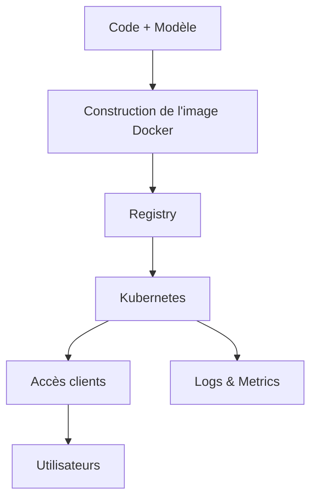

<h1 id="intro-linux-ia">Introduction à Linux pour l'Intelligence Artificielle</h1>

Apprenez à utiliser Linux pour **développer**, **entraîner** et **déployer** des projets d’IA.  
Pas besoin d’être un expert système : ce guide va droit au but avec des explications simples et des exemples concrets.

<h2 id="ressources">Ressources complémentaires</h2>

Les exercices, scripts d’installation et configurations détaillées sont fournis dans le repository associé à ce cours.  
💡 Vous pouvez directement exécuter les scripts sans tout retaper à la main.

<h2 id="toc">Table des matières</h2>

1. [Pourquoi utiliser Linux pour l’IA ?](#pourquoi-linux-ia)  
2. [Les outils d’IA disponibles sous Linux](#ecosysteme-ia)  
3. [Quelles distributions choisir pour démarrer ?](#distributions-ia)  
4. [Comment gérer ses environnements Python](#environnements-python)  
5. [Accélérer ses calculs avec un GPU](#acceleration-gpu)  
6. [Isoler ses projets avec des containers](#containers-ia)  
7. [Les bibliothèques essentielles](#frameworks-bibliotheques)  
8. [Organiser et stocker ses données](#gestion-donnees)  
9. [Déployer un modèle en production](#deploiement-production)  
10. [Surveiller et optimiser ses entraînements](#monitoring-optimisation)  
11. [Exemples pratiques](#annexe-exemples-pratiques)  

<h2 id="pourquoi-linux-ia">1. Pourquoi utiliser Linux pour l’IA ?</h2>

Linux est le système le plus utilisé par les chercheurs et ingénieurs IA.  

Pourquoi ?  
- **Rapide** : il gère très bien CPU et GPU.  
- **Ouvert** : tout est open source et gratuit.  
- **Flexible** : fonctionne du simple PC portable jusqu’au supercalculateur.  
- **Fiable** : on peut reproduire la même configuration partout (local, cloud, cluster).  

**Cycle de vie typique d’un projet IA** :

```mermaid
flowchart LR
  A[Exploration] --> B[Préparation des données]
  B --> C[Entraînement]
  C --> D[Évaluation]
  D --> E[Packaging]
  E --> F[Déploiement]
  F --> G[Surveillance & Améliorations]
  G --> B
````

<h2 id="ecosysteme-ia">2. Les outils d’IA disponibles sous Linux</h2>

* **Applications** : Jupyter (notebooks interactifs), MLflow (suivi d’expériences), Streamlit/Gradio (interfaces web rapides).
* **Frameworks** : PyTorch, TensorFlow, scikit-learn, XGBoost.
* **Calcul parallèle** : CUDA (NVIDIA), ROCm (AMD), Dask ou Ray (calcul distribué).
* **Infrastructure** : Docker (containers), Kubernetes (orchestration), SLURM (HPC).

**Vue d’ensemble** :

```mermaid
mindmap
root((Linux & IA))
  Applications
    Jupyter
    MLflow
    Streamlit
    Gradio
  Frameworks
    PyTorch
    TensorFlow
    Scikit-learn
    XGBoost
  Parallélisation
    CUDA
    ROCm
    Dask
    Ray
  Infra
    Docker
    Kubernetes
    SLURM
    Singularity
```

<h2 id="distributions-ia">3. Quelles distributions choisir pour démarrer ?</h2>

👉 Si vous débutez, prenez **Ubuntu 22.04 LTS** : simple, bien documenté, compatible GPU.

Autres choix possibles :

| Distribution      | Cas d’usage    | Points forts              |
| ----------------- | -------------- | ------------------------- |
| Rocky/AlmaLinux 9 | Serveurs/HPC   | Stabilité, proche de RHEL |
| Pop!_OS           | PC personnel   | Excellent support GPU     |
| Lambda Stack      | IA clé en main | PyTorch/TensorFlow + CUDA |
| Debian            | Usage général  | Solide et très stable     |

<h2 id="environnements-python">4. Comment gérer ses environnements Python</h2>

Le problème classique : *“ça marchait hier mais plus aujourd’hui…”*
C’est souvent à cause de conflits de versions.

* **Conda/Mamba** : pratique pour tester, chaque projet a son environnement.
* **Poetry** : utile pour des bibliothèques partagées.
* **Docker + venv** : en production, pour avoir un environnement identique partout.

<h2 id="acceleration-gpu">5. Accélérer ses calculs avec un GPU</h2>

Un GPU est essentiel pour l’IA moderne.

* **NVIDIA (CUDA)** : le plus utilisé (cuDNN, TensorRT, PyTorch-CUDA).
* **AMD (ROCm)** : alternative ouverte, mais dépend du matériel.
* **Multi-GPU** : on peut entraîner sur plusieurs cartes avec NCCL, Gloo, MPI.

💡 Vérifier si PyTorch voit le GPU :

```python
import torch
print(torch.cuda.is_available())
```

<h2 id="containers-ia">6. Isoler ses projets avec des containers</h2>

* **Docker** : éviter les “ça marche chez moi mais pas chez toi”.
* **Kubernetes** : pour gérer plusieurs containers et déployer à grande échelle.
* **Singularity** : utilisé en HPC, pas besoin d’être administrateur.

<h2 id="frameworks-bibliotheques">7. Les bibliothèques essentielles</h2>

* **Machine Learning** : scikit-learn, XGBoost, LightGBM.
* **Deep Learning** : PyTorch (souvent préféré), TensorFlow/Keras.
* **Visualisation** : Matplotlib, Seaborn, Plotly.
* **Suivi d’expériences** : MLflow, Weights & Biases.

<h2 id="gestion-donnees">8. Organiser et stocker ses données</h2>

Bonnes pratiques :

* Séparer **données brutes**, **données traitées**, et **résultats**.
* Versionner avec **DVC** ou **Git LFS**.
* Utiliser des formats efficaces comme **Parquet**.
* Stocker modèles et checkpoints sur **S3/GCS/MinIO**.

<h2 id="deploiement-production">9. Déployer un modèle en production</h2>

* **Serving** : FastAPI, TorchServe, TensorFlow Serving, Triton.
* **Automatisation (CI/CD)** : GitHub Actions ou GitLab CI pour tester et déployer.
* **Monitoring** : Prometheus + Grafana pour surveiller métriques et alertes.

**Chaîne typique** :



<h2 id="monitoring-optimisation">10. Surveiller et optimiser ses entraînements</h2>

* **Sur la machine** : `htop` (CPU), `nvidia-smi` (GPU).
* **Pour les modèles** : profiler PyTorch/TensorFlow, quantification, pruning, ONNX.
* **Optimisation** : TensorRT pour accélérer l’inférence.

<h2 id="annexe-exemples-pratiques">11. Exemples pratiques</h2>

Dans le dossier du repo :

* `scripts/env_cpu.sh` → créer un environnement Python minimal (CPU).
* `scripts/pytorch_cuda.sh` → installer PyTorch + CUDA et tester le GPU.
* `scripts/mlflow_local.sh` → lancer MLflow en local.
* `docker/Dockerfile` → exemple d’image Docker pour servir un modèle.

```


Veux-tu que je te propose aussi un **fichier `SUMMARY.md`** (style GitBook / MkDocs) pour générer automatiquement un menu latéral avec ces ancres ?
```
