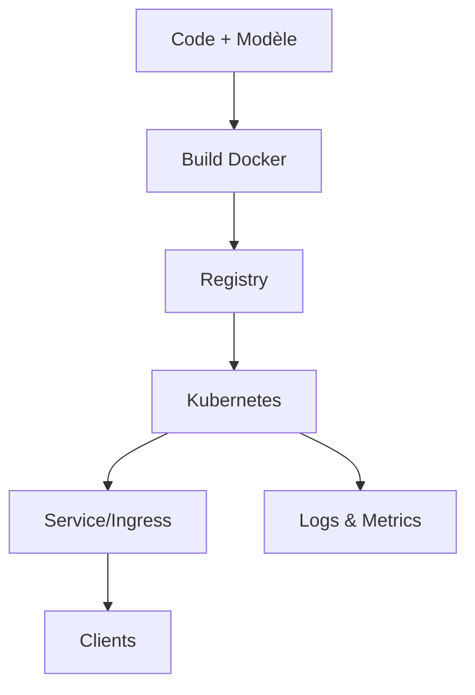

<h1 id="intro-linux-ia">Introduction à Linux pour l'Intelligence Artificielle</h1>

Objectif : passer de “je n’ai jamais touché Linux” à “je peux entraîner un modèle et le déployer proprement”.

<h2 id="ce-que-vous-allez-apprendre">Ce que vous allez apprendre</h2>

- Comprendre pourquoi Linux est la base de l’IA moderne.
- Installer un environnement Python propre (qui ne se casse pas).
- Utiliser votre GPU (ou vérifier clairement s’il est utile/disponible).
- Lancer un entraînement, suivre les expériences, déployer une petite API.
- Diagnostiquer ce qui rame (CPU, GPU, RAM, disque, dépendances).

<h2 id="plan-express">Plan express (vue d’ensemble)</h2>

```mermaid
flowchart LR
  A[Linux prêt] --> B[Env. Python isolé]
  B --> C[GPU OK]
  C --> D[Entraînement simple]
  D --> E[Suivi expériences]
  E --> F[Packaging & Docker]
  F --> G[API d'inférence]
  G --> H[Monitoring & itérations]
````

<h2 id="pourquoi-linux-ia">1. Pourquoi Linux pour l’IA ?</h2>

* Performance : Linux contrôle mieux le matériel (CPU/GPU/IO).
* Ouverture : tout l’écosystème IA est né et optimisé pour Linux.
* Portabilité : le même projet tourne identique en local, sur serveur, en cloud.
* Coût et robustesse : moins de licences, plus de documentation, plus de contrôle.

<h2 id="ecosysteme-ia">2. L’écosystème IA sous Linux, en un coup d’œil</h2>

```mermaid
mindmap
root((Linux & IA))
  Applications
    Jupyter
    MLflow
    Streamlit
    Gradio
  Frameworks
    PyTorch
    TensorFlow
    Scikit-learn
    XGBoost
  Parallélisation
    CUDA (NVIDIA)
    ROCm (AMD)
    Dask
    Ray
  Infra
    Docker
    Kubernetes
    SLURM
    Singularity
```

<h2 id="debuter-5-min">3. Démarrer en 5 minutes (si vous êtes pressé)</h2>

1. Ouvrir un terminal et vérifier Python :

```
python3 --version
```

2. Créer un environnement isolé (au choix) :

```
# Variante rapide : venv
python3 -m venv .venv && source .venv/bin/activate
pip install --upgrade pip

# Variante “scientifique” : conda/mamba
mamba create -n ia python=3.11 -y && mamba activate ia
```

3. Installer PyTorch CPU (fonctionne partout) :

```
pip install torch torchvision torchaudio --index-url https://download.pytorch.org/whl/cpu
```

4. Vérifier :

```python
import torch
print(torch.__version__, torch.cuda.is_available())
```

Si `cuda.is_available()` renvoie False sur une machine NVIDIA, passez à la section GPU.

<h2 id="distributions-ia">4. Linux : par où commencer ?</h2>

* Recommandé : **Ubuntu 22.04 LTS** (simple, bien documenté, compatible GPU).
* Alternatives :

  * Pop!_OS (excellent sur poste de travail NVIDIA)
  * Rocky/AlmaLinux (serveurs/HPC)
  * Debian (ultra stable)
  * Lambda Stack (pile IA pré-installée)

<h2 id="environnements-python">5. Environnements Python : garder un système propre</h2>

Problème classique : conflits de versions. Antidotes :

* **Conda/Mamba** : idéal pour explorer, un environnement par projet.
* **Poetry** : pour publier/partager une librairie.
* **Docker + venv** : en prod, on fige les versions dans une image.

Règle d’or : un projet = un environnement. Évitez `pip install` global.

<h2 id="acceleration-gpu">6. Activer le GPU (NVIDIA/AMD)</h2>

* NVIDIA = CUDA/cuDNN/TensorRT (le plus mature).
* AMD = ROCm/MIOpen (selon matériel).

Vérifier le GPU :

```
nvidia-smi
```

Si la commande existe et liste votre GPU, installez PyTorch CUDA depuis la doc officielle. Test minimal :

```python
import torch
x = torch.randn(1000, 1000, device="cuda")
print("CUDA OK:", torch.cuda.is_available(), x.sum().item())
```

Multi-GPU/cluster : NCCL, Gloo, MPI et réseau rapide (InfiniBand/RDMA).

<h2 id="containers-ia">7. Conteneurs : “ça marche chez moi” → “ça marche partout”</h2>

* **Docker** : isole les dépendances, partage sans douleur.
* **Kubernetes** : orchestre à grande échelle (jobs d’entraînement, autoscaling).
* **Singularity/Apptainer** : standard HPC sans droits administrateur.

Dockerfile minimal pour servie une API d’inférence (FastAPI) :

```
FROM python:3.11-slim
WORKDIR /app
COPY requirements.txt .
RUN pip install --no-cache-dir -r requirements.txt
COPY . .
CMD ["uvicorn", "app:api", "--host", "0.0.0.0", "--port", "8080"]
```

<h2 id="frameworks-bibliotheques">8. Bibliothèques essentielles (traduction simple)</h2>

* **scikit-learn** : ML “classique” (régression, forêts, SVM).
* **XGBoost/LightGBM** : modèles en arbres très performants.
* **PyTorch** : deep learning flexible, très populaire en R&D.
* **TensorFlow/Keras** : alternative très outillée, production-friendly.
* **Matplotlib/Seaborn/Plotly** : visualisation.
* **MLflow/Weights & Biases** : suivi d’expériences et comparaisons.

<h2 id="gestion-donnees">9. Données : simple et durable</h2>

* Séparer **brut** / **traité** / **artefacts** (modèles, checkpoints).
* Versionner (DVC, Git LFS).
* Formats efficaces (Parquet pour tables).
* Stockage d’artefacts compatible S3 (MinIO en local, S3/GCS en cloud).
* Secrets dans `.env` (jamais dans Git).

<h2 id="deploiement-production">10. De l’entraînement au service en ligne</h2>

* Serving : FastAPI, TorchServe, TF Serving, **Triton** (optimisé NVIDIA).
* CI/CD : GitHub Actions/GitLab CI (tests → build → push image → déploiement).
* Observabilité : logs structurés, métriques (Prometheus/Grafana), traçage.

Chaîne type :



<h2 id="monitoring-optimisation">11. Surveiller et accélérer</h2>

* Système : `htop` (CPU/RAM), `iotop` (disque), `vmstat` (mémoire), `iostat` (IO).
* GPU : `nvidia-smi`, `nvtop`, `gpustat`.
* Modèles : profiler PyTorch/TF, quantification, pruning, ONNX, TensorRT.

<h2 id="mini-labs">12. Mini-labs (10 à 15 minutes chacun)</h2>

Mini-lab A — Environnement propre (CPU) :

```
python3 -m venv .venv && source .venv/bin/activate
pip install --upgrade pip "torch==2.*" "scikit-learn==1.*" "mlflow==2.*"
python -c "import torch, mlflow, sklearn; print('OK', torch.__version__)"
```

Mini-lab B — Vérifier le GPU :

```
nvidia-smi
python - << 'PY'
import torch
print('CUDA dispo :', torch.cuda.is_available())
if torch.cuda.is_available():
    x = torch.randn(10000,10000, device='cuda'); print(float(x.sum()))
PY
```

Mini-lab C — Lancer MLflow en local :

```
mlflow ui --port 5000
# Ouvrir http://localhost:5000
```

Mini-lab D — API d’inférence FastAPI (CPU) :

```
pip install fastapi uvicorn
cat > app.py << 'PY'
from fastapi import FastAPI
from pydantic import BaseModel
import torch

api = FastAPI()

class Input(BaseModel):
    x: float
    y: float

@api.post("/predict")
def predict(inp: Input):
    with torch.no_grad():
        z = torch.tensor([inp.x, inp.y]).sum().item()
    return {"sum": z}
PY
uvicorn app:api --reload --port 8080
# Tester: curl -X POST http://localhost:8080/predict -H "Content-Type: application/json" -d '{"x":1.2,"y":3.4}'
```

<h2 id="checklist-debutant">13. Checklist débutant → opérationnel</h2>

* [ ] Ubuntu 22.04 installé ou WSL2 configuré.
* [ ] Terminal fonctionnel, `git` et `python3` présents.
* [ ] Environnement isolé créé (venv/conda) et activé.
* [ ] PyTorch CPU installé et import OK.
* [ ] GPU détecté par `nvidia-smi` (si machine NVIDIA).
* [ ] Un entraînement jouet tourne (notebook ou script).
* [ ] MLflow affiche une expérimentation.
* [ ] API FastAPI répond à une requête POST en local.
* [ ] Dockerfile construit une image qui démarre l’API.

<h2 id="glossaire-eclair">14. Glossaire éclair (1 phrase par mot)</h2>

* **Conda/Mamba** : gestionnaire d’environnements et de paquets scientifiques.
* **venv** : environnement Python minimal intégré à Python.
* **Docker** : boîte fermée qui contient votre appli + ses dépendances.
* **Kubernetes** : gère et déploie beaucoup de boîtes Docker automatiquement.
* **SLURM** : planifie des jobs sur de gros serveurs partagés (HPC).
* **CUDA/ROCm** : couches logicielles pour faire calculer le GPU.
* **MLflow/W&B** : carnet de bord automatique de vos expériences.
* **Triton/TensorRT** : accélère fortement l’inférence sur GPU NVIDIA.
* **Parquet** : format de fichier colonne rapide pour l’analytics.
* **DVC** : versionne les données comme Git versionne le code.

<h2 id="exemples-pratiques">15. Exemples pratiques (dans le repo)</h2>

* `scripts/env_cpu.sh` : environnement Python minimal (CPU).
* `scripts/pytorch_cuda.sh` : installation PyTorch + CUDA + test GPU.
* `scripts/mlflow_local.sh` : lancement rapide de MLflow.
* `docker/Dockerfile` : image minimale pour servir une API d’inférence.
* `examples/fastapi/` : exemple complet d’API avec test.

```
---

Ce texte est prêt à publier et pensé pour “première écoute/lecture”.  
Si tu veux, je peux aussi te fournir **les fichiers réels** correspondants (`requirements.txt`, `app.py`, `Dockerfile`, `scripts/*.sh`) alignés exactement sur ce plan.
```
