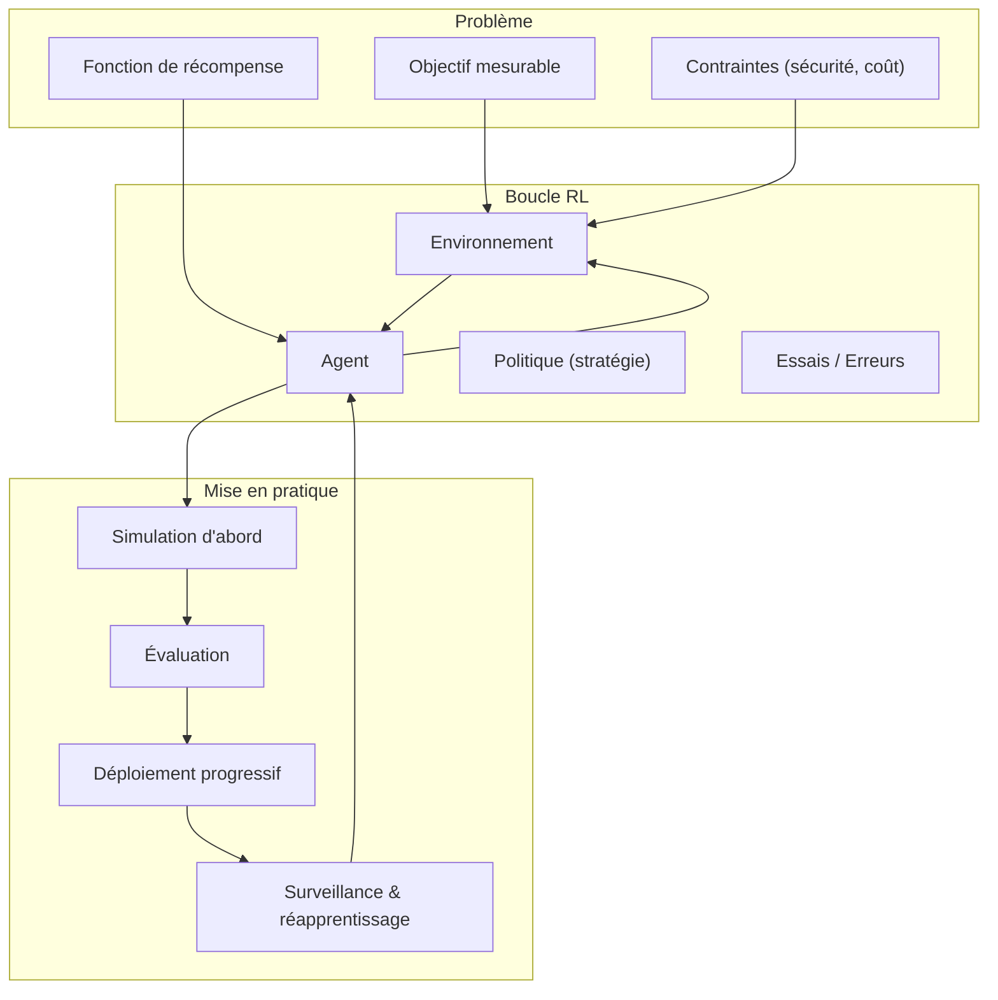
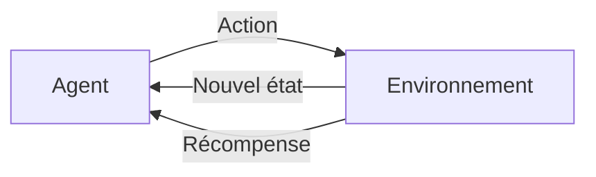
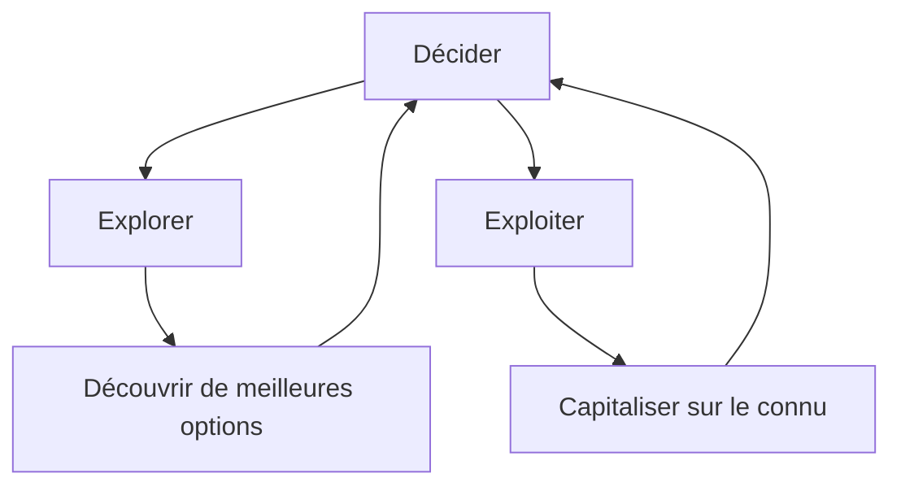
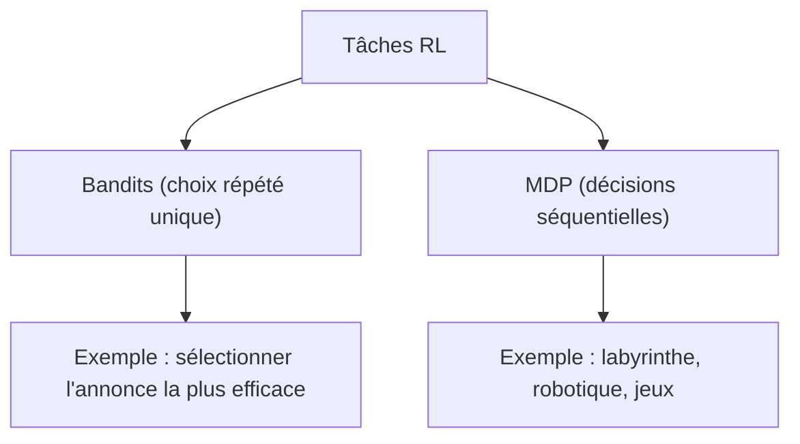
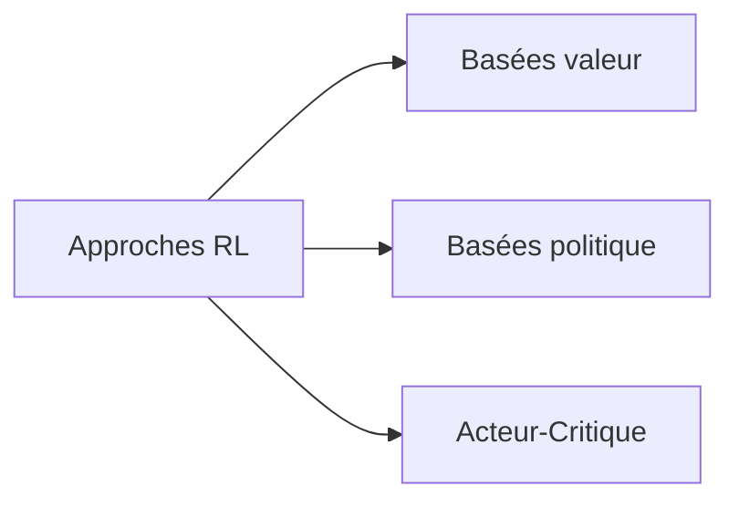
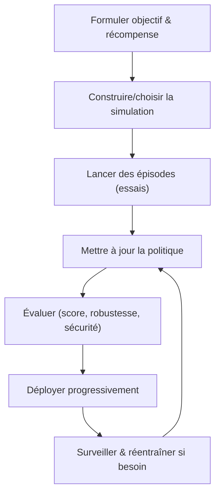
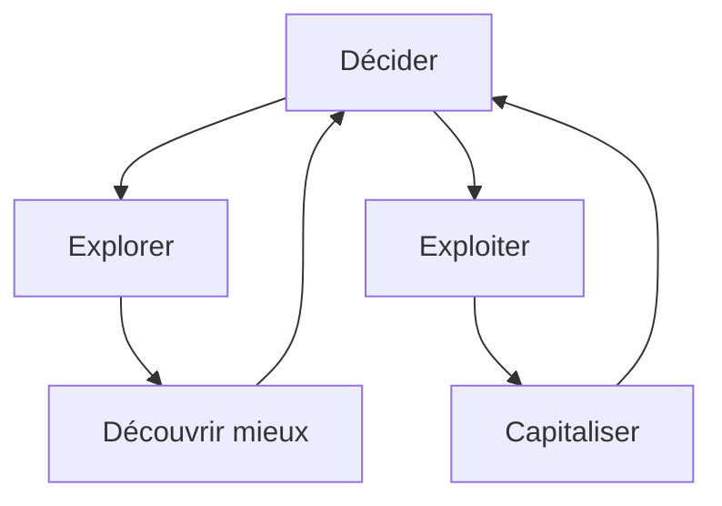
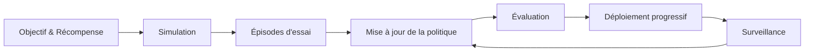

<h1 id="intro-rl">De l’Erreur à l’Excellence : l’apprentissage par renforcement (RL) en action</h1>

Objectif : offrir une vue d’ensemble claire et non technique du **Reinforcement Learning (RL)** — du principe d’essais/erreurs jusqu’au déploiement — avec des repères concrets pour se situer.

<h2 id="carte-densemble">1. Carte d’ensemble</h2>

<h2 id="idee-cle">2. Idée clé</h2>

Le RL apprend **par essais et erreurs**. Un **agent** agit dans un **environnement**, reçoit une **récompense** (score positif/négatif), et améliore sa **politique** (façon d’agir) pour maximiser la somme des récompenses.

<h2 id="concepts">3. Concepts fondamentaux</h2>

* **Agent** : décideur (robot, programme).
* **Environnement** : le monde où l’agent évolue (jeu, entrepôt, réseau).
* **État** : ce que l’agent observe pour décider.
* **Action** : ce que l’agent fait.
* **Récompense** : retour numérique après l’action (guide l’apprentissage).
* **Politique** : stratégie de décision (état → action).

<h2 id="exemple">4. Exemple simple</h2>

Robot nettoyeur dans une maison :
récompense positive quand une pièce sale devient propre ; pénalité s’il percute un mur ou perd du temps.
Avec l’expérience, il évite les obstacles et priorise les zones sales.

<h2 id="exploration">5. Explorer vs exploiter</h2>

* **Explorer** : tester de nouvelles actions pour découvrir mieux.
* **Exploiter** : réutiliser ce qui marche déjà pour gagner vite.
  Un bon agent alterne les deux.

<h2 id="quand">6. Quand utiliser (ou non) le RL</h2>

Pertinent si :

* le monde est **dynamique** et difficile à programmer exhaustivement ;
* on sait définir un **score** aligné métier ;
* on peut s’exercer en **simulation** ou en bac à sable.

À éviter si :

* il existe un **jeu de données étiqueté** suffisant (préférer l’apprentissage supervisé) ;
* chaque erreur est **trop coûteuse** (à encadrer fortement via simulateurs/règles).

<h2 id="taches">7. Types de tâches</h2>

<h2 id="familles">8. Grandes familles d’approches (sans équations)</h2>

* **Basées valeur (Q-learning, etc.)** : estimer la valeur attendue d’une action et choisir la meilleure.
* **Basées politique (policy gradient)** : apprendre directement une politique optimale.
* **Acteur-Critique** : combiner politique (acteur) et évaluation (critique).

<h2 id="recompense">9. Bien définir la récompense</h2>

La récompense dirige le comportement. Si elle est mal définie, l’agent optimise un mauvais objectif.
Recommandations :

* formuler un **objectif métier** clair ;
* ajouter des **pénalités** pour comportements indésirables (coût, sécurité, délais) ;
* **tester en simulation** avant le réel.

<h2 id="workflow">10. Workflow d’un mini-projet RL</h2>

<h2 id="erreurs">11. Erreurs fréquentes et parades</h2>

* **Récompense mal conçue** → l’agent optimise autre chose.
  Parades : revue métier, tests en simulation, pénalités d’abus.
* **Manque d’exploration** → stagnation.
  Parades : aléa contrôlé, horaires d’exploration, essais planifiés.
* **Changement du réel** → baisse de performance.
  Parades : surveillance, tests de régression, réapprentissage périodique.
* **Essais réels coûteux/risqués**.
  Parades : simulateurs, bac à sable, garde-fous.

<h2 id="atelier">12. Mini-atelier papier (10 minutes)</h2>

1. Dessiner un **labyrinthe 5×5**.
2. Placer un **départ**, un **trésor**, des **pièges**.
3. Récompense : **+10** trésor, **−5** piège, **−1** par pas.
4. Jouer 5 épisodes à la main ; noter les scores.
5. Discuter : comment l’“agent” a-t-il alterné exploration/exploitation ?

<h2 id="glossaire">13. Glossaire express</h2>

* **État** : information disponible pour décider.
* **Action** : mouvement/décision de l’agent.
* **Récompense** : retour numérique positif/négatif.
* **Politique** : règle pour choisir les actions.
* **Épisode** : partie complète du départ à la fin.
* **Retour** : somme des récompenses d’un épisode.

<h2 id="diagrammes">14. Diagrammes</h2>

Boucle agent–environnement :

Explorer vs exploiter :

Workflow projet :

<h2 id="checklist">15. Checklist 30 secondes</h2>

* Objectif mesurable et **récompense alignée** définis.
* **Simulation** ou bac à sable disponible.
* Stratégie d’**exploration/exploitation** décidée.
* **Métriques** d’évaluation et scénarios difficiles prévus.
* Plan de **déploiement progressif** et de **surveillance**.

En résumé, le RL permet d’apprendre à **décider dans le temps** grâce aux retours de l’environnement, à condition de définir une **récompense pertinente**, de **s’entraîner en sécurité**, puis de **déployer progressivement** avec mesure et garde-fous.
